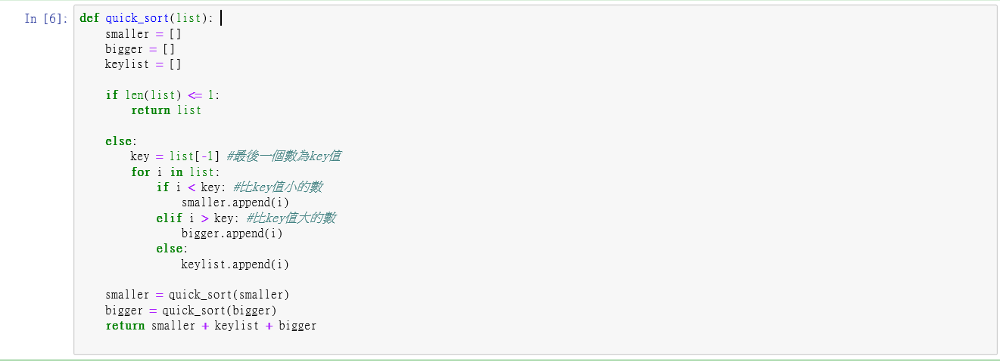

作業程式碼(圖片)+解釋
====
首先要先自首，這程式碼是我從網路上找來，也是我目前看到別人寫，最淺顯易懂，最簡潔的一位
------

解釋
------

def quick_sort(list):    
    smaller = []    
    bigger = []    
    keylist = []    

    if len(list) <= 1:
        return list

    else:
        key = list[-1] #最後一個數為key值
        for i in list:
            if i < key: #比key值小的數
                smaller.append(i)
            elif i > key: #比key值大的數
                bigger.append(i)
            else:
                keylist.append(i)

    smaller = quick_sort(smaller)
    bigger = quick_sort(bigger)
    return smaller + keylist + bigger
當中
