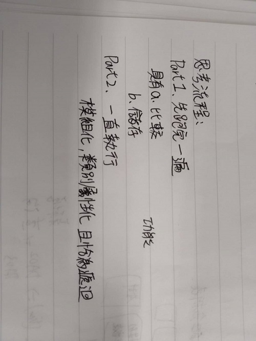
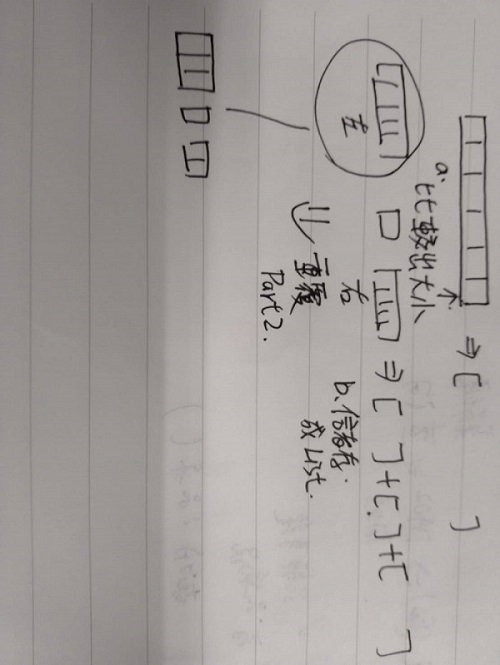

接近我親手構成的程式碼
------
    alist=[2,5,8,9,7,6,5,9,8,2,5]
    right=[]
    left=[]
    i=0
    while i<len(alist):
        if alist[i]>alist[-1]:
            right.append(alist[i])
        else:
            left.append(alist[i])
        i=i+1
學習歷程
------
    對演算法的戰略思考
    我先將演算法切成兩部分
    Part1.先完整的能夠跑完一次
    Part2.再思考如何一直切
    我目前進度只完成Part1
    那過程中我挑網路上別人的程式，我找我看得懂的程式碼，因為我程度很低，所以挑最簡單，最不複雜的開始學
    看別人如何將想法程式化
    那本身我的想法也契合這次我找的程式碼
    我思考的步驟:
    Part1我又將其切割成兩步驟
    第一步:比較
    第二步:儲存
    最開始就想說quick_sort是透過每個在list的元素，一一向最後一個比較，這功能我寫的出來嗎?
    答案是可以，因為for x in xxx 就是將xxx，中的每個元素一一放進x，在執行下方程式碼，真正讓我覺得困擾的是
    做完之後我該如何儲存，可以用tony=dsf，方式存嗎?
    不行，但我又不會其它種方式來一一儲存元素，最後構成list，所以我不用for 那單用while呢?
    while 要先有值在while外面
    n=0 
    while alist[i]<alist[-1]:
	    left=alist[i]
	    i=i+1
    這時出現兩個問題
    1.當i=i+1時，如果情況是這樣
    alist=[2,7,4,8,6]
    那我碰到7就停下來的
    2.前面提到的問題left=alist[i]永遠只會存一個數
    第一個問題:
    我是這樣解決的，為避免碰到前面就停下我就採用if 所有比它大就到右邊去，這樣
    那單用if還有一個問題alist[i]，中的i不會動了，因為我要將所有元素一一比較，所以這個功能不能放棄，所以我就綜合起來
    採用外面用while，裡面用if
    第二個問題:
    我就是在尋找這過程中，束手無策就找到了參考的程式碼，從而才知道不要死板想一個問題，用[1]+[2]=[1,2]原理去思考
    就可以解決了
學習歷程手寫簡圖
------

別人流程圖
------

